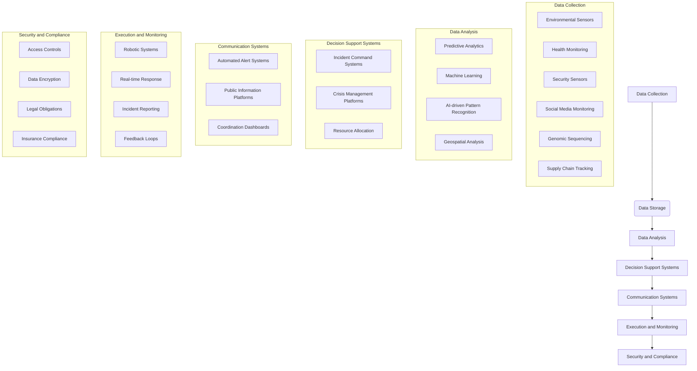
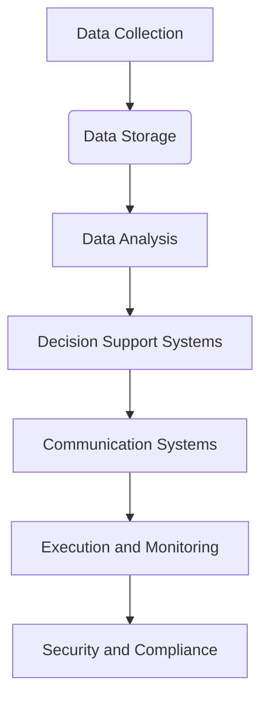
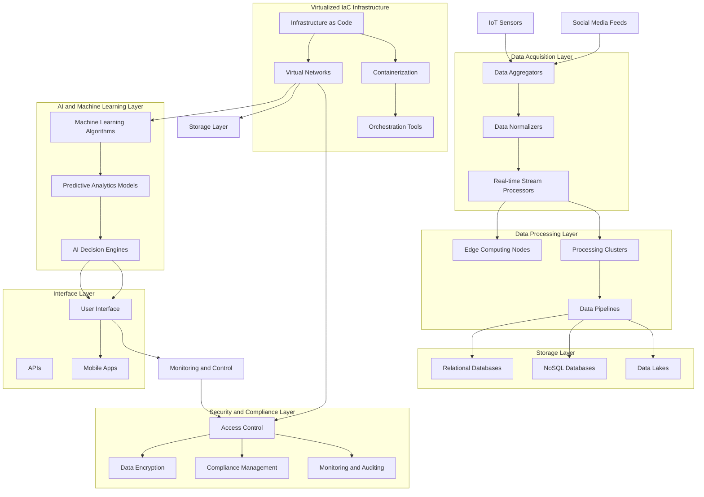

# [idea2030.com](http://www.idea2030.com)

Offer for Biosoc CBRNe Crisis Simulation Training and Exercises

Driven by the idea that you learn best by doing, Biosoc presents a comprehensive range of crisis simulation training tailored to equip your teams with the necessary skills for effective crisis management and communication. Our signature approach blends realistic, hands-on experience with critical theoretical knowledge, ensuring your organization is prepared for any emergency.

## Our Services

1. Tailor-Made Exercises:
Crisotech develops immersive, fictitious crisis scenarios where participants actively engage in managing simulated crises. Each scenario is crafted with multiple inputs across tactical, operational, and strategic levels, simulating real-world conditions on various themes such as cyber crisis, industrial accidents, terrorism, natural disasters, and social crises.

- Key Focus:
  - Shared Trust: Building confidence among team members.
  - Stress Management: Handling high-pressure situations effectively.
  - Decision-Making in Emergencies: Making informed decisions quickly.

2. Major Exercises:
- Test coordination and information sharing between multiple organizations or internal entities.
- Utilize diverse communication channels (SMS, calls, emails, intranets, dedicated software).

3. Restricted Exercises:
- Focus on internal crisis unit operations, task allocation, information processing, and decision-making processes.

4. Tabletop Exercises:
- Simulated closed-environment crise exercises with external stakeholder roles played by Crisotech, including field teams, first responders, and media.

5. Field Exercises:
- Practical tests of procedures like evacuation, confinement, or assistance for operational teams.

6. Cyber Crisis Exercises:
- Comprehensive preparation for handling cyber crises with a 360° approach.
- Involvement of general management's crisis unit, technical units (SSI – SOC), and communication unit.
- Simulated media and societal pressure.
- Forensic investigation training options available.
- Incident response strategy and remediation.
- Hot and cold feedback sessions for continuous improvement.

## Mediatraining

1. Media Communication Training:
- Training for media interaction in and out of crises.
- Blend of theoretical insights and practical exercises.
- Personalised guidance on effective communication, stress reduction, and message delivery.

2. TV Studio Training:
- Real-life conditions simulation with professional equipment including:
  - Cameras, microphones, lighting kits, TV mixers, and audio/video monitors.
- Ideal for crisis simulation exercises and mediatraining.

## Fictitious Environment Simulation

Crisotech creates realistic scenarios with defined missions, objectives, geographical contexts, economic and media settings, and workforce. This immersive approach familiarizes participants with crisis unit functionalities, roles, coordination needs, and the utility of situation reports.

Applications:
   - Practice handling situations such as industrial action, attacks, natural disasters, or foodborne illnesses (TIAC).

Conclusion

With Biosoc’s crisis simulation training and exercises, your teams will gain invaluable experience and skills to manage crises effectively. Our realistic, action-oriented training modules ensure preparedness for any emergency situation, fostering shared trust, improving stress management, and enhancing decision-making abilities.

---

For further information or to schedule a session, please contact us at [contact information] or visit in Latvia, Poland, Germany, ...

## Workshops from Biocomputing to Biosoc and CBRNE Incidents

These workshops are designed to provide immersive, hands-on experiences that prepare society for a variety of crises. Participants will gain practical knowledge and skills that improve their readiness and resilience in facing real-world emergencies.

### Topic: Simulation Exercise to Prepare Society on Various Crisis Scenarios

1. Simulation Exercise to Prepare Society on Cybersecurity Threats: 
- Description: Explore realistic cybersecurity scenarios where participants will learn about threat detection, response strategies, and crisis communication under simulated cyber-attacks.
- Key Focus Areas:
  - Identifying and mitigating cybersecurity breaches.
  - Effective communication with stakeholders during a cyber crisis.
  - Legal and insurance compliance.
  - Forensic investigation techniques.

2. Simulation Exercise to Prepare Society on Industrial Accidents:
- Description: Engage in simulations of industrial accidents to assess and improve response plans, safety protocols, and emergency communication.
- Key Focus Areas:
   - Rapid response actions.
   - Coordination with emergency services.
   - Employee evacuation and safety measures.
   - Crisis communication with the public and media.

3. Simulation Exercise to Prepare Society on Terrorism Threats:
- Description: Participate in comprehensive simulations to prepare for potential terrorist attacks, with a focus on immediate response, coordination, and public safety.
- Key Focus Areas:
   - Threat assessment and initial response.
   - Coordination with law enforcement and counter-terrorism units.
   - Crisis communication and rumor control.
   - Psychological first aid and victim support.

4. Simulation Exercise to Prepare Society on Natural Disasters:
- Description: Conduct simulations involving natural disasters like earthquakes, floods, and hurricanes to reinforce emergency preparedness and community response strategies.
- Key Focus Areas:
   - Evacuation plans and shelter management.
   - Resource allocation and logistics.
   - Communication channels during and after the disaster.
   - Long-term recovery planning.

5. Simulation Exercise to Prepare Society on Social Crises:
- Description: Engage in scenarios addressing social crises such as public protests, civil unrest, or large-scale community disruptions to practice effective response and management.
- Key Focus Areas:
   - Managing large crowds and maintaining public order.
   - Effective use of social media and other communication platforms.
   - Ensuring safety and security during public events.
   - Conflict resolution and negotiation.

6. Simulation Exercise to Prepare Society on Bioengineered Pathogens and Biocomputing Challenges: 
- Description: Immerse in simulated scenarios involving bioengineered pathogens and the intersection of biocomputing, focusing on containment, crisis response, and data management.
- Key Focus Areas:
   - Detection and containment strategies.
   - Crisis communication with health and governmental authorities.
   - Data security and management in biocomputing environments.
   - Coordination with healthcare providers and researchers.

7. Simulation Exercise to Prepare Society on Chemical, Biological, Radiological, Nuclear, and Explosive (CBRNE) Incidents:
- Description: Comprehensive simulations to handle CBRNE incidents, focusing on immediate response, decontamination procedures, and public safety.
- Key Focus Areas:
   - Identification and classification of CBRNE threats.
   - Rapid response and decontamination operations.
   - Communication strategies for public safety.
   - Integrated response with specialized CBRNE units.

8. Simulation Exercise to Prepare Society on Foodborne Illness Outbreaks:
- Description: Realistic simulations addressing food safety and responding to foodborne illness outbreaks, emphasizing rapid detection, containment, and communication.
- Key Focus Areas:
   - Detection and containment of foodborne pathogens.
   - Coordination with health departments and food safety authorities.
   - Effective public communication to prevent widespread panic.
   - Long-term strategies for food safety and prevention.

### Prevention and Handling of Incidents with Biocomputing and Biocomputers

Prevention and handling of various crises can be significantly enhanced through the strategic use of biocomputing and biocomputers. By integrating advanced biotechnologies, predictive analytics, and automated systems, organizations can effectively mitigate risks, respond efficiently to incidents, and ensure public safety and resilience.

1. Prevention Strategies:

a. Cybersecurity Threats:
- Advanced Threat Detection: Implement machine learning algorithms and AI-powered tools to detect anomalies and potential threats in real-time.
- Regular Updates and Patches: Ensure all biocomputing systems and software are regularly updated to protect against vulnerabilities.
- Employee Training: Conduct regular cybersecurity training sessions for employees to recognize phishing attacks and other social engineering tactics.
- Strong Access Controls: Use biometrics, multi-factor authentication (MFA), and secure access protocols to prevent unauthorized access.

b. Industrial Accidents:
- Predictive Maintenance: Utilize biocomputing systems to predict equipment failures before they occur through data analysis and modeling.
- Safety Protocols: Embed safety protocols and automated shut-off systems within biocomputers to respond rapidly to hazardous situations.
- Environmental Monitoring: Deploy sensors and biocomputing networks to continuously monitor environmental conditions and detect potential risks.

c. Terrorism Threats:
- Intelligence Gathering: Use biocomputing for data mining and pattern recognition to gather intelligence on potential threats.
- Surveillance Systems: Integrate biocomputing with surveillance systems to identify suspicious activities and individuals.
- Community Awareness: Raise public awareness on recognizing and reporting suspicious activities through community programs and training.

d. Natural Disasters:
- Early Warning Systems: Develop biocomputer-aided early warning systems that utilize big data and predictive analytics to forecast natural disasters.
- Disaster Preparedness Plans: Implement biocomputing platforms for planning and managing disaster preparedness drills and resource allocation.
- Geospatial Analysis: Utilize geospatial data and biocomputing to identify high-risk areas and infrastructure vulnerabilities.

e. Social Crises:
- Social Media Monitoring: Employ biocomputing to monitor social media and detect signs of emerging social crises or unrest.
- Crisis Communication Plans: Design automated, biocomputer-driven communication channels to disseminate accurate information quickly.
- Public Engagement Tools: Use biocomputing to create platforms that facilitate community dialogue and conflict resolution.

f. Bioengineered Pathogens and Biocomputing Challenges:
- Genomic Surveillance: Employ biocomputers to perform genomic sequencing and detect dangerous bioengineered pathogens early.
- Secure Research Networks: Maintain secure networks and data encryption to safeguard sensitive biocomputing research and intellectual property.
- Collaboration Platforms: Use biocomputing to create global collaboration platforms for researchers and health authorities to share data and insights.

g. CBRNE Incidents:
- Detection Systems: Develop biocomputers integrated with sensors to detect chemical, biological, radiological, nuclear, and explosive materials.
- Simulation Training: Utilize biocomputing to create realistic simulation environments for training first responders and crisis managers.
- Decontamination Robots: Deploy biocomputer-controlled robots for safe and efficient decontamination procedures.

h. Foodborne Illness Outbreaks:
- Supply Chain Monitoring: Use biocomputing to track and analyze data throughout the food supply chain for early detection of contamination.
- Predictive Analytics: Implement biocomputer algorithms to predict and model the spread of foodborne pathogens.
- Automated Reporting Systems: Develop automated biocomputer systems for rapid reporting and response to food safety incidents.

2. Handling Incidents:

a. Real-Time Monitoring and Response:
- Incident Command Systems: Build biocomputing-based incident command systems for centralizing control and improving coordination during a crisis.
- Real-Time Data Analytics: Use biocomputing for real-time data collection and analysis to inform decision-making and response strategies.

b. Communication and Coordination:
- Automated Alert Systems: Implement biocomputer systems to send automated alerts to emergency response teams and the public.
- Crisis Management Platforms: Utilize biocomputer-driven platforms for coordinated crisis response across multiple agencies and organizations.

c. Resource Management:
- Logistics Optimization: Employ biocomputing for efficient resource allocation and logistics management during emergencies.
- Supply Chain Integrity: Leverage biocomputing to maintain the integrity and traceability of supply chains in crises, especially for medical supplies and food.

d. Post-Incident Analysis and Feedback:
- Forensic Analysis: Utilize biocomputing systems to conduct forensic analysis of incidents, identifying causes and areas for improvement.
- Feedback Loops: Create continuous feedback mechanisms using biocomputing to gather insights and refine crisis response plans.

e. Community Engagement and Support:
- Public Information Systems: Use biocomputing to develop platforms that provide accurate, timely information to the public during and after a crisis.
- Psychosocial Support: Implement biocomputing systems to connect affected individuals with mental health resources and support networks.

The biocomputing ecosystem in relation to crisis management, followed by a Mermaid diagram to visually represent the relationships.

### Biocomputing Ecosystem:

1. **Data Collection**
   - Sensors (Environmental, Health, Security)
   - Social Media Monitoring
   - Genomic Sequencing
   - Supply Chain Tracking

2. **Data Storage**
   - Secure Databases
   - Distributed Ledger (Blockchain)
   - Cloud Storage

3. **Data Analysis**
   - Predictive Analytics
   - Machine Learning Algorithms
   - AI-driven Pattern Recognition
   - Geospatial Analysis

4. **Decision Support Systems**
   - Incident Command Systems
   - Crisis Management Platforms
   - Resource Allocation Tools

5. **Communication Systems**
   - Automated Alert Systems
   - Public Information Platforms
   - Coordination Dashboards

6. **Execution and Monitoring**
   - Robotic Systems (Decontamination, Rescue)
   - Real-time Response Management
   - Incident Reporting and Feedback Loops

7. **Security and Compliance**
   - Access Controls
   - Data Encryption
   - Legal and Insurance Obligations

### Mermaid Diagram:

Below is how the ecosystem components can be visualized using Mermaid syntax:

- **Data Collection** gathers information through various sensors and monitoring systems.
- **Data Storage** securely holds the collected data.
- **Data Analysis** leverages advanced technologies like Machine Learning and AI to make sense of the stored data.
- **Decision Support Systems** guide crisis management through tools and platforms based on analyzed data.
- **Communication Systems** ensure that alerts and important information are disseminated effectively.
- **Execution and Monitoring** include using robotic systems for action and real-time monitoring for ongoing crisis response.
- **Security and Compliance** ensure that all operations comply with legal and security standards.

This visualization reflects how each component of the biocomputing ecosystem interrelates and contributes to effective crisis management.

## Architecture

The architecture integrates IoT sensors for data collection, uses virtualized infrastructure for efficient resource management, leverages AI for advanced data analytics, and ensures secure, compliant operations through robust security mechanisms. This architecture not only supports crisis detection and response but also enhances overall operational resilience and efficiency.
This includes detailing the core components, data flow, and how the various technologies interact.

### Internal Architecture of a Biocomputer

**Core Components:**
1. **IoT Sensors**
2. **Data Acquisition Layer**
3. **Data Processing Layer**
4. **Storage Layer**
5. **Virtualized IaC Infrastructure**
6. **AI and Machine Learning Layer**
7. **Interface Layer (APIs and User Interface)**
8. **Security and Compliance Layer**

### Detailed Architecture:

#### 1. IoT Sensors
- **Environmental Sensors**: Measure temperature, humidity, pressure, etc.
- **Health Monitoring Sensors**: Track vital signs, biochemical levels.
- **Security Sensors**: Detect movements, breaches, radiation, etc.
- **Social Media Feeds**: Gather data from social platforms for sentiment analysis and crisis detection.

#### 2. Data Acquisition Layer
- **Data Aggregators**: Collect data from various IoT sensors.
- **Data Normalizers**: Transform raw sensor data into a standardized format.
- **Real-time Stream Processors**: Handle continuous data streams for immediate analysis.

#### 3. Data Processing Layer
- **Edge Computing Nodes**: Perform preliminary data processing near the data source to reduce latency.
- **Processing Clusters**: Use distributed computing resources to process large volumes of data.
- **Data Pipelines**: Manage the flow of data from acquisition to storage, ensuring smooth transitions and consistency.

#### 4. Storage Layer
- **Relational Databases**: Store structured data with complex relationships.
- **NoSQL Databases**: Handle unstructured or semi-structured data (e.g., sensor logs, social media feeds).
- **Data Lakes**: Central repositories for storing raw and processed data, enabling advanced analytics and machine learning.

#### 5. Virtualized IaC Infrastructure
- **Infrastructure as Code (IaC)**: Automates the deployment and management of infrastructure using code.
- **Virtual Networks**: Create and manage virtual networks connecting various components.
- **Containerization**: Deploy applications and services in containers for scalability and portability (e.g., Docker).
- **Orchestration Tools**: Manage the deployment, scaling, and operations of containerized applications (e.g., Kubernetes).

#### 6. AI and Machine Learning Layer
- **Predictive Analytics Models**: Use historical data to predict future events and outcomes.
- **Machine Learning Algorithms**: Develop models to recognize patterns and anomalies in real-time.
- **AI Decision Engines**: Automate response actions based on machine learning predictions.

#### 7. Interface Layer (APIs and User Interface)
- **APIs**: Provide programmatic access to data, processing capabilities, and machine learning models.
- **User Interface**: Dashboards and visualization tools for real-time monitoring and control.
- **Mobile Apps**: Offer remote access and control capabilities.

#### 8. Security and Compliance Layer
- **Access Control**: Implement strong authentication and authorization mechanisms.
- **Data Encryption**: Secure data in transit and at rest.
- **Compliance Management**: Ensure adherence to legal and regulatory standards.
- **Monitoring and Auditing**: Continually monitor systems for security breaches and compliance violations.

### Data Flow and Interaction:

1. **Data Collection**:
- IoT sensors and social media feeds gather data from various sources.
- Data Aggregators collect and send this data to the Data Acquisition Layer.

2. **Initial Processing**:
- The Data Acquisition Layer normalizes the data and performs real-time stream processing.
- Edge Computing Nodes handle preliminary processing near the data source.

3. **Data Processing**:
- Data flows to Processing Clusters and through Data Pipelines for in-depth analysis.
- The processing results are stored in appropriate storage solutions (Relational Databases, NoSQL, Data Lakes).

4. **Infrastructure Management**:
- IaC automates the deployment of necessary infrastructure components.
- Virtual Networks ensure secure communication between components.
- Containers and Orchestration Tools manage applications and services efficiently.

5. **Advanced Analysis**:
- The AI and Machine Learning Layer employs predictive models and machine learning algorithms.
- Real-time data and historical data are used to generate insights and automate decision-making.

6. **User Interaction**:
- APIs allow integration with other systems and facilitate programmatic interactions.
- User Interface dashboards provide monitoring and control.
- Mobile apps enable remote access, ensuring stakeholders can interact with biocomputer capabilities from anywhere.

7. **Security and Compliance**:
- Continuous monitoring and auditing ensure security integrity.
- Access controls and data encryption standards are strictly enforced.

### Visual Representation:

Here’s a visual overview of the architecture, represented with Mermaid syntax:

[World Economic Forum Identifies Top 10 Emerging Technologies to Address Global Challenges > Press releases - World Economic Forum](https://www.weforum.org/press/2024/06/world-economic-forum-identifies-top-10-emerging-technologies-to-address-global-challenges/)

The Top 10 Emerging Technologies of 2024 are:

1. AI for scientific discovery: While artificial intelligence (AI) has been used in research for many years, advances in deep learning, generative AI and foundation models are revolutionizing the scientific discovery process. AI will enable researchers to make unprecedented connections and advancements in understanding diseases, proposing new materials, and enhancing knowledge of the human body and mind​​.
2. Privacy-enhancing technologies: Protecting personal privacy while providing new opportunities for global data sharing and collaboration, “synthetic data” is set to transform how information is handled with powerful applications in health-related research.

3. Reconfigurable intelligent surfaces: These innovative surfaces turn ordinary walls and surfaces into intelligent components for wireless communication while enhancing energy efficiency in wireless networks. They hold promise for numerous applications, from smart factories to vehicular networks​​.
4. High-altitude platform stations: Using aircraft, blimps and balloons, these systems can extend mobile network access to remote regions, helping bridge the digital divide for over 2.6 billion people worldwide​​.
5. Integrated sensing and communication: The advent of 6G networks facilitates simultaneous data collection (sensing) and transmission (communication). This enables environmental monitoring systems that help in smart agriculture, environmental conservation and urban planning. Integrated sensing and communication devices also promise to reduce energy and silicon consumption.
6. Immersive technology for the built world: Combining computing power with virtual and augmented reality, these technologies promise rapid improvements in infrastructure and daily systems​. This technology allows designers and construction professionals to check for correspondence between physical and digital models, ensuring accuracy and safety and advancing sustainability.
7. Elastocalorics: As global temperatures rise, the need for cooling solutions is set to soar. Offering higher efficiency and lower energy use, elastocalorics release and absorb heat under mechanical stress, presenting a sustainable alternative to current technologies.

8. Carbon-capturing microbes: Engineered organisms convert emissions into valuable products like biofuels, providing a promising approach to mitigating climate change.
9. Alternative livestock feeds: protein feeds for livestock sourced from single-cell proteins, algae and food waste could offer a sustainable solution for the agricultural industry.
10. Genomics for transplants: The successful implantation of genetically engineered organs into a human marks a significant advancement in healthcare, offering hope to millions awaiting transplants​​.

[Applied AI and Cutting-edge Technology Start-ups Dominate this Year’s 100 New Members of the World Economic Forum’s Technology Pioneers Community > Press releases | World Economic Forum](https://www.weforum.org/press/2024/06/applied-ai-and-cutting-edge-technology-start-ups-dominate-this-year-s-100-new-members-of-the-world-economic-forum-s-technology-pioneers-community/)

Neurotechnology

Neurotechnology is another area of rapid innovation, with more than $8 billion in venture capital investment to date in and growing ($1.4 billion was raised by neurotech companies in 2023, double the amount raised in 2022, according to Pitchbook article). Four neurotechnology start-ups are in this year’s cohort – BrainQ Technologies, Neurable, OpenBCI and NextSense, which will engage with the AI Governance Alliance.

Europe

Algorithmiq (Finland), harnessing the power of quantum computing to solve complex problems in life sciences.
Bioptimus (France), building the first and only reference multilevel foundation model for biology that will transform multiscale data into actionable representations to fuel breakthrough discoveries in biomedicine.
constellr (Germany), delivering daily global land surface temperature (LST) data from space optimized for smart farming.
DePoly (Switzerland), allowing the chemical recycling of polyethylene terephthalate (PET) plastic back to its main components.
Dioxycle (France), pioneering breakthrough carbon electrolysis technologies that convert industrial emissions into sustainable, cost-competitive ethylene.
Dotlumen (Romania), using self-driving technology scaled down in the world's first headset to empower the blind.
Evroc (Sweden), building a sustainable hyperscale cloud and AI infrastructure for the world with a strong focus on privacy.
HelloBetter (Germany), developing Digital Therapeutics (DTx), by translating cognitive behavioural therapy into a digital product experience.
Isometric (United Kingdom), issuing scientifically rigorous, high-quality carbon credits and improving transparency and increasing the speed of carbon crediting.
Made of Air (Germany), functionalizes biochar to fill materials – transforming its carbon removal promise into usable, high volume, carbon-negative materials.
Marvel Fusion (Germany), utilizing high-intensity ultra-short lasers and nanostructured fuel targets to commercialize fusion energy.
NatureMetrics (United Kingdom), turning the complexities of nature into simple biodiversity insights and metrics to support nature impact reporting.
PlanQC (Germany), building quantum computers that store information in single atoms.
Pledge (United Kingdom), decarbonization for logistics supply chains helping businesses understand, report and reduce their emissions.
Proxima Fusion (Germany), developing fusion power plants based on QI stellarator technology.
Qubit Pharmaceuticals (France), quantum-aided drug discovery.
Space Forge (United Kingdom), advanced materials and in-space manufacturing company using extreme temperature, microgravity and ultra-high vacuum conditions available in low earth orbit to manufacture materials that cannot readily be grown terrestrially.
Supercritical (United Kingdom), helping businesses get to net zero by measuring their carbon footprint and selling them carbon removal offsets.
SWISSto12 (Switzerland), 3D printing technologies for high-performance radio frequency (RF) products and applications and the manufacturing of entire geostationary telecom satellites.
UNIO Enterprise (Germany), delivering internet connectivity to mobile users through a satellite constellation.

China

Botree Recycling (People’s Republic of China), providing a full solution for the recycling of critical battery materials.
Deeplang AI (People’s Republic of China), reshaping knowledge-workers’ information processing workflow empowered by large language model technology.
Dongsheng AI (People’s Republic of China), building industrial vision and AI algorithms for use within the industrial automation sector.
HiDream.ai (People’s Republic of China), building generative-AI powered visual multimodality foundation models and applications.
SenseDeal (People’s Republic of China), developing enterprise-level large model applications and unstructured data intelligent processing engines.
TerraQuanta (People’s Republic of China), large AI weather model for renewable energy and electricity trading.
Triastek (People’s Republic of China), pioneering a 3D printing pharmaceutical process to transform the delivery, development and production of medication.
Viture (People’s Republic of China), XR glasses with near-universal device compatibility.
Weiyun AI & Robotics Group (People’s Republic of China), combining medical health and AI to manufacture clinical dental products through custom robots and smart factories.
Westlake Omics (People’s Republic of China), leveraging AI-empowered proteomics technology to provide protein measurement services and clinical tests for disease diagnosis and prognosis.
Yrobot (People’s Republic of China), building soft and lightweight wearable robots that can effectively assist patients with neuromuscular impairments both in hospital and at home.

Latin America

Bright Cities (Brazil), generating diagnostics and roadmaps for cities and the public sector.
Nagro (Brazil), lending and financial technology for agribusiness.
PhageLab (Chile), creating the fastest diagnosis AI-powered platform to fully characterize pathogenic bacteria and to pair them with the right bacteriophages for effective elimination.
Vammo (Brazil), building IoT-enhanced electric motorcycles, supported by a network of battery swapping stations.

Middle East and North Africa

Aim Security (Israel), providing guardrails for secure and safe use of large language models (LLMs).
BrainQ (Israel), developing precision neurology therapies using brain-computer interface technology, designed to target damaged neuronal networks and facilitate neuro-recovery.
Enzymit (Israel), leveraging advanced AI to engineer novel enzymes creating a cell-free platform that facilitates the sustainable and efficient production of valuable chemicals.
Imagindairy (Israel), using proprietary AI models and precision fermentation to efficiently produce sustainable and affordable animal-free dairy proteins.
Khazna (Egypt), building the Workforce Bank for the underserved across the Middle East, starting with Egypt and Saudi Arabia.
Wanda Fish (Israel), producing fish fillets by isolating fish cells and growing them in a controlled environment.

North America

2045 Studio (USA), creating a pathway for companies to build cultures rooted in belonging, retention and promotion.
Amini (USA), solving Africa’s environmental data scarcity by leveraging emerging AI tools and space technologies to support sustainability and climate initiatives for the continent.
Artyc (USA), democratizing cold chain access by creating high-quality, accessible and sustainable solutions for all.
Automotus (USA), helping cities reduce emissions, safety hazards and congestion by automating payment and enforcement at the kerb with computer vision.
Brimstone Energy (USA), building a technology to do lower-cost production of carbon-negative ordinary portland cement.
Camus Energy (USA), enabling utilities to harness local energy resources for active management of network capacity and reliable operations for a fully electrified, zero-carbon grid.
Captura (USA), leveraging the natural carbon removal powers of the ocean to remove CO2 from the atmosphere at scale.
Carbon Upcycling Technologies (Canada), capturing CO2 in industrial byproducts to create material to both sequester and avoid cement emissions.
CATALOG Technologies (USA), a DNA-based platform for digital data storage and computing.
Censia (USA), delivering bias-free AI and predictive analytics to empower large enterprises globally to make data-driven people decisions.
Cybera (USA), automating global criminal complaint filing in line with INTERPOL recommendations to alert banks, crypto exchanges and law enforcement globally.
Dazz (USA), solving vulnerabilities and preventing risks in cloud development environments.
ELSA (USA), leveraging machine learning, generative AI and advanced speech recognition technology to improve users' English-speaking communication.
Evrnu (USA), converting textile waste into a new high-performance fibre that is recyclable, biodegradable and compostable.
Fero Labs (USA), AI-driven platform providing predictions backed by confidence bands, full transparency and explainability so factories make efficient production changes.
Fourth Power (USA), scalable thermal battery technology storing excess renewable energy as heat and releasing it as electricity on demand to the grid for both long and short durations.
Heirloom Carbon (USA), accelerating the carbon mineralization process to rapidly and permanently remove CO2 from the atmosphere and then store it safely.
Inclusively (USA), aiding individuals with disabilities in identifying workplace accommodations and enhancing productivity, retention and access to diverse talent pools.
Juvena Therapeutics (USA), developing disease-modifying biologics to treat chronic muscle and metabolic diseases by unlocking the therapeutic potential of stem-cell secreted proteins.
Kintsugi (USA), voice biomarker software harnessing the power of AI and free-form speech to detect signs and severity of mental health conditions.
Moonhub (USA), providing a recruiter-on-demand platform powered by AI.
Neurable (USA), scaling neuroimaging into everyday products.
NextSense (USA), building a brain-responsive earbud for real-time sleep enhancement.
Nth Cycle (USA), transforming the outputs of metal scrap, electronics recycling, untapped mining resources and waste from existing mines into high-purity critical minerals ready to be used in new production.
Oleria (USA), securely managing access to decentralized SaaS apps and sensitive data.
OpenBCI (USA), building hardware and software for interfacing the human body, brain and mind.
Pictory (USA), using AI to automate the conversion of long-form content into engaging, concise videos.
Populus (USA), providing cities with a software platform to manage connected fleet vehicles to deliver safer and more sustainable streets.
Rabbit (USA), developing a personalized operating system, Rabbit OS, capable of understanding complex user intentions, operating user interfaces and performing actions on behalf of the user through natural language.
Re-Nuble (USA), converting unrecoverable food waste into a suite of biological fertilizers and crop residue into peat-free horticultural substrates.
Robigo (USA), leveraging cutting edge biotechnology tools like CRISPR and RNAi to empower microbes to protect crops from disease and improve crop yields.
Robust.AI (USA), an industrial-grade cognitive engine leveraging robotics and AI technology for warehouse logistics and manufacturing.
Skygrid (USA), building high-assurance, third-party services to enable the safe operations and airspace integration of autonomous aircraft.
Thea Energy (USA), reinventing the stellarator using computer-controlled arrays of planar coils and replacing the intricate, complex modular magnets required in all other proposed stellarator architectures.
Valora (USA), enabling global peer-to-peer payments and access to decentralized financial tools.
Vibrant Planet (USA), a scenario planning, monitoring and reporting system helping natural resource managers and community protectors prioritize the deployment of resources to build wildfire and climate resilience.
You.com (USA), operating a private search engine to summarize the web for users.

South Asia

Amperehour Solar (India), creating dispatchable renewable energy generating plants.
Cropin (India), developing a farm monitoring and management solution to help farmers geo-tag their farms, digitize farm records, monitor crop productivity and improve farm activity.
Entri (India), giving access to learning and upskilling programmes in Indian local languages.
HealthPlix (India), developing AI-powered electronic medical records software for the healthcare sector.
International Battery Company (India), manufacturing large-sized rechargeable prismatic li-ion nickel manganese cobalt batteries.
Niramai (India), developing a novel AI-based test for detecting early-stage breast cancer, which is affordable, portable and non-invasive.
NxtWave (India), providing AI-driven, vernacular-based coding courses, enabling thousands of previously unemployed students to secure jobs.
Pixxel (India), developing hyperspectral satellite imagery to capture geospatial data.
Sarvam AI (India), building foundation AI models and platforms for their use with a focus on Indian languages and use cases.
String Bio (India), producing next-generation ingredients for agriculture, animal feed and human nutrition from GHG gases.

## Another Simulations:

+ [Simulation exercise on preparedness for cross-border spread of healthcare-associated drug-resistant bacteria](https://www.ecdc.europa.eu/en/news-events/simulation-exercise-preparedness-cross-border-spread-healthcare-associated-drug)
+ [The first national simulation exercise on combating trafficking in human beings | OSCE](https://www.osce.org/mission-to-moldova/558640)
+ [Training and crisis simulation exercises - ChapsVision CyberGov](https://www.chapsvision-cybergov.com/crisis-management/training-exercices/)
