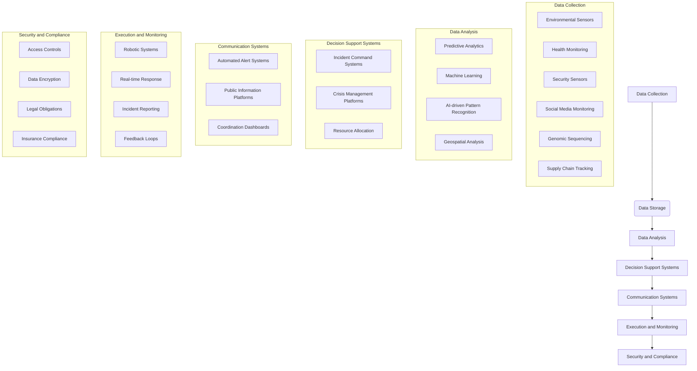
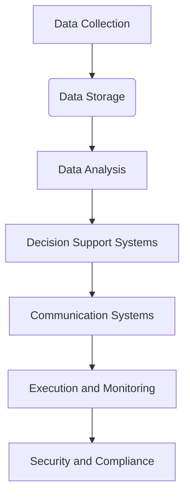

# [idea2030.com](http://www.idea2030.com)

Offer for Biosoc CBRNe Crisis Simulation Training and Exercises

Driven by the idea that you learn best by doing, Biosoc presents a comprehensive range of crisis simulation training tailored to equip your teams with the necessary skills for effective crisis management and communication. Our signature approach blends realistic, hands-on experience with critical theoretical knowledge, ensuring your organization is prepared for any emergency.

## Our Services

1. Tailor-Made Exercises:
Crisotech develops immersive, fictitious crisis scenarios where participants actively engage in managing simulated crises. Each scenario is crafted with multiple inputs across tactical, operational, and strategic levels, simulating real-world conditions on various themes such as cyber crisis, industrial accidents, terrorism, natural disasters, and social crises.

- Key Focus:
  - Shared Trust: Building confidence among team members.
  - Stress Management: Handling high-pressure situations effectively.
  - Decision-Making in Emergencies: Making informed decisions quickly.

2. Major Exercises:
- Test coordination and information sharing between multiple organizations or internal entities.
- Utilize diverse communication channels (SMS, calls, emails, intranets, dedicated software).

3. Restricted Exercises:
- Focus on internal crisis unit operations, task allocation, information processing, and decision-making processes.

4. Tabletop Exercises:
- Simulated closed-environment crise exercises with external stakeholder roles played by Crisotech, including field teams, first responders, and media.

5. Field Exercises:
- Practical tests of procedures like evacuation, confinement, or assistance for operational teams.

6. Cyber Crisis Exercises:
- Comprehensive preparation for handling cyber crises with a 360° approach.
- Involvement of general management's crisis unit, technical units (SSI – SOC), and communication unit.
- Simulated media and societal pressure.
- Forensic investigation training options available.
- Incident response strategy and remediation.
- Hot and cold feedback sessions for continuous improvement.

## Mediatraining

1. Media Communication Training:
- Training for media interaction in and out of crises.
- Blend of theoretical insights and practical exercises.
- Personalised guidance on effective communication, stress reduction, and message delivery.

2. TV Studio Training:
- Real-life conditions simulation with professional equipment including:
  - Cameras, microphones, lighting kits, TV mixers, and audio/video monitors.
- Ideal for crisis simulation exercises and mediatraining.

## Fictitious Environment Simulation

Crisotech creates realistic scenarios with defined missions, objectives, geographical contexts, economic and media settings, and workforce. This immersive approach familiarizes participants with crisis unit functionalities, roles, coordination needs, and the utility of situation reports.

Applications:
   - Practice handling situations such as industrial action, attacks, natural disasters, or foodborne illnesses (TIAC).

Conclusion

With Biosoc’s crisis simulation training and exercises, your teams will gain invaluable experience and skills to manage crises effectively. Our realistic, action-oriented training modules ensure preparedness for any emergency situation, fostering shared trust, improving stress management, and enhancing decision-making abilities.

---

For further information or to schedule a session, please contact us at [contact information] or visit in Latvia, Poland, Germany, ...

## Workshops from Biocomputing to Biosoc and CBRNE Incidents

These workshops are designed to provide immersive, hands-on experiences that prepare society for a variety of crises. Participants will gain practical knowledge and skills that improve their readiness and resilience in facing real-world emergencies.

### Topic: Simulation Exercise to Prepare Society on Various Crisis Scenarios

1. Simulation Exercise to Prepare Society on Cybersecurity Threats: 
- Description: Explore realistic cybersecurity scenarios where participants will learn about threat detection, response strategies, and crisis communication under simulated cyber-attacks.
- Key Focus Areas:
  - Identifying and mitigating cybersecurity breaches.
  - Effective communication with stakeholders during a cyber crisis.
  - Legal and insurance compliance.
  - Forensic investigation techniques.

2. Simulation Exercise to Prepare Society on Industrial Accidents:
- Description: Engage in simulations of industrial accidents to assess and improve response plans, safety protocols, and emergency communication.
- Key Focus Areas:
   - Rapid response actions.
   - Coordination with emergency services.
   - Employee evacuation and safety measures.
   - Crisis communication with the public and media.

3. Simulation Exercise to Prepare Society on Terrorism Threats:
- Description: Participate in comprehensive simulations to prepare for potential terrorist attacks, with a focus on immediate response, coordination, and public safety.
- Key Focus Areas:
   - Threat assessment and initial response.
   - Coordination with law enforcement and counter-terrorism units.
   - Crisis communication and rumor control.
   - Psychological first aid and victim support.

4. Simulation Exercise to Prepare Society on Natural Disasters:
- Description: Conduct simulations involving natural disasters like earthquakes, floods, and hurricanes to reinforce emergency preparedness and community response strategies.
- Key Focus Areas:
   - Evacuation plans and shelter management.
   - Resource allocation and logistics.
   - Communication channels during and after the disaster.
   - Long-term recovery planning.

5. Simulation Exercise to Prepare Society on Social Crises:
- Description: Engage in scenarios addressing social crises such as public protests, civil unrest, or large-scale community disruptions to practice effective response and management.
- Key Focus Areas:
   - Managing large crowds and maintaining public order.
   - Effective use of social media and other communication platforms.
   - Ensuring safety and security during public events.
   - Conflict resolution and negotiation.

6. Simulation Exercise to Prepare Society on Bioengineered Pathogens and Biocomputing Challenges: 
- Description: Immerse in simulated scenarios involving bioengineered pathogens and the intersection of biocomputing, focusing on containment, crisis response, and data management.
- Key Focus Areas:
   - Detection and containment strategies.
   - Crisis communication with health and governmental authorities.
   - Data security and management in biocomputing environments.
   - Coordination with healthcare providers and researchers.

7. Simulation Exercise to Prepare Society on Chemical, Biological, Radiological, Nuclear, and Explosive (CBRNE) Incidents:
- Description: Comprehensive simulations to handle CBRNE incidents, focusing on immediate response, decontamination procedures, and public safety.
- Key Focus Areas:
   - Identification and classification of CBRNE threats.
   - Rapid response and decontamination operations.
   - Communication strategies for public safety.
   - Integrated response with specialized CBRNE units.

8. Simulation Exercise to Prepare Society on Foodborne Illness Outbreaks:
- Description: Realistic simulations addressing food safety and responding to foodborne illness outbreaks, emphasizing rapid detection, containment, and communication.
- Key Focus Areas:
   - Detection and containment of foodborne pathogens.
   - Coordination with health departments and food safety authorities.
   - Effective public communication to prevent widespread panic.
   - Long-term strategies for food safety and prevention.

### Prevention and Handling of Incidents with Biocomputing and Biocomputers

Prevention and handling of various crises can be significantly enhanced through the strategic use of biocomputing and biocomputers. By integrating advanced biotechnologies, predictive analytics, and automated systems, organizations can effectively mitigate risks, respond efficiently to incidents, and ensure public safety and resilience.

1. Prevention Strategies:

a. Cybersecurity Threats:
- Advanced Threat Detection: Implement machine learning algorithms and AI-powered tools to detect anomalies and potential threats in real-time.
- Regular Updates and Patches: Ensure all biocomputing systems and software are regularly updated to protect against vulnerabilities.
- Employee Training: Conduct regular cybersecurity training sessions for employees to recognize phishing attacks and other social engineering tactics.
- Strong Access Controls: Use biometrics, multi-factor authentication (MFA), and secure access protocols to prevent unauthorized access.

b. Industrial Accidents:
- Predictive Maintenance: Utilize biocomputing systems to predict equipment failures before they occur through data analysis and modeling.
- Safety Protocols: Embed safety protocols and automated shut-off systems within biocomputers to respond rapidly to hazardous situations.
- Environmental Monitoring: Deploy sensors and biocomputing networks to continuously monitor environmental conditions and detect potential risks.

c. Terrorism Threats:
- Intelligence Gathering: Use biocomputing for data mining and pattern recognition to gather intelligence on potential threats.
- Surveillance Systems: Integrate biocomputing with surveillance systems to identify suspicious activities and individuals.
- Community Awareness: Raise public awareness on recognizing and reporting suspicious activities through community programs and training.

d. Natural Disasters:
- Early Warning Systems: Develop biocomputer-aided early warning systems that utilize big data and predictive analytics to forecast natural disasters.
- Disaster Preparedness Plans: Implement biocomputing platforms for planning and managing disaster preparedness drills and resource allocation.
- Geospatial Analysis: Utilize geospatial data and biocomputing to identify high-risk areas and infrastructure vulnerabilities.

e. Social Crises:
- Social Media Monitoring: Employ biocomputing to monitor social media and detect signs of emerging social crises or unrest.
- Crisis Communication Plans: Design automated, biocomputer-driven communication channels to disseminate accurate information quickly.
- Public Engagement Tools: Use biocomputing to create platforms that facilitate community dialogue and conflict resolution.

f. Bioengineered Pathogens and Biocomputing Challenges:
- Genomic Surveillance: Employ biocomputers to perform genomic sequencing and detect dangerous bioengineered pathogens early.
- Secure Research Networks: Maintain secure networks and data encryption to safeguard sensitive biocomputing research and intellectual property.
- Collaboration Platforms: Use biocomputing to create global collaboration platforms for researchers and health authorities to share data and insights.

g. CBRNE Incidents:
- Detection Systems: Develop biocomputers integrated with sensors to detect chemical, biological, radiological, nuclear, and explosive materials.
- Simulation Training: Utilize biocomputing to create realistic simulation environments for training first responders and crisis managers.
- Decontamination Robots: Deploy biocomputer-controlled robots for safe and efficient decontamination procedures.

h. Foodborne Illness Outbreaks:
- Supply Chain Monitoring: Use biocomputing to track and analyze data throughout the food supply chain for early detection of contamination.
- Predictive Analytics: Implement biocomputer algorithms to predict and model the spread of foodborne pathogens.
- Automated Reporting Systems: Develop automated biocomputer systems for rapid reporting and response to food safety incidents.

2. Handling Incidents:

a. Real-Time Monitoring and Response:
- Incident Command Systems: Build biocomputing-based incident command systems for centralizing control and improving coordination during a crisis.
- Real-Time Data Analytics: Use biocomputing for real-time data collection and analysis to inform decision-making and response strategies.

b. Communication and Coordination:
- Automated Alert Systems: Implement biocomputer systems to send automated alerts to emergency response teams and the public.
- Crisis Management Platforms: Utilize biocomputer-driven platforms for coordinated crisis response across multiple agencies and organizations.

c. Resource Management:
- Logistics Optimization: Employ biocomputing for efficient resource allocation and logistics management during emergencies.
- Supply Chain Integrity: Leverage biocomputing to maintain the integrity and traceability of supply chains in crises, especially for medical supplies and food.

d. Post-Incident Analysis and Feedback:
- Forensic Analysis: Utilize biocomputing systems to conduct forensic analysis of incidents, identifying causes and areas for improvement.
- Feedback Loops: Create continuous feedback mechanisms using biocomputing to gather insights and refine crisis response plans.

e. Community Engagement and Support:
- Public Information Systems: Use biocomputing to develop platforms that provide accurate, timely information to the public during and after a crisis.
- Psychosocial Support: Implement biocomputing systems to connect affected individuals with mental health resources and support networks.

Certainly! Below is a breakdown of the biocomputing ecosystem in relation to crisis management, followed by a Mermaid diagram to visually represent the relationships.

### Biocomputing Ecosystem:

1. **Data Collection**
   - Sensors (Environmental, Health, Security)
   - Social Media Monitoring
   - Genomic Sequencing
   - Supply Chain Tracking

2. **Data Storage**
   - Secure Databases
   - Distributed Ledger (Blockchain)
   - Cloud Storage

3. **Data Analysis**
   - Predictive Analytics
   - Machine Learning Algorithms
   - AI-driven Pattern Recognition
   - Geospatial Analysis

4. **Decision Support Systems**
   - Incident Command Systems
   - Crisis Management Platforms
   - Resource Allocation Tools

5. **Communication Systems**
   - Automated Alert Systems
   - Public Information Platforms
   - Coordination Dashboards

6. **Execution and Monitoring**
   - Robotic Systems (Decontamination, Rescue)
   - Real-time Response Management
   - Incident Reporting and Feedback Loops

7. **Security and Compliance**
   - Access Controls
   - Data Encryption
   - Legal and Insurance Obligations

### Mermaid Diagram:

Below is how the ecosystem components can be visualized using Mermaid syntax:

- **Data Collection** gathers information through various sensors and monitoring systems.
- **Data Storage** securely holds the collected data.
- **Data Analysis** leverages advanced technologies like Machine Learning and AI to make sense of the stored data.
- **Decision Support Systems** guide crisis management through tools and platforms based on analyzed data.
- **Communication Systems** ensure that alerts and important information are disseminated effectively.
- **Execution and Monitoring** include using robotic systems for action and real-time monitoring for ongoing crisis response.
- **Security and Compliance** ensure that all operations comply with legal and security standards.

This visualization reflects how each component of the biocomputing ecosystem interrelates and contributes to effective crisis management.

## Another Simulations:

+ [Simulation exercise on preparedness for cross-border spread of healthcare-associated drug-resistant bacteria](https://www.ecdc.europa.eu/en/news-events/simulation-exercise-preparedness-cross-border-spread-healthcare-associated-drug)
+ [The first national simulation exercise on combating trafficking in human beings | OSCE](https://www.osce.org/mission-to-moldova/558640)
+ [Training and crisis simulation exercises - ChapsVision CyberGov](https://www.chapsvision-cybergov.com/crisis-management/training-exercices/)
